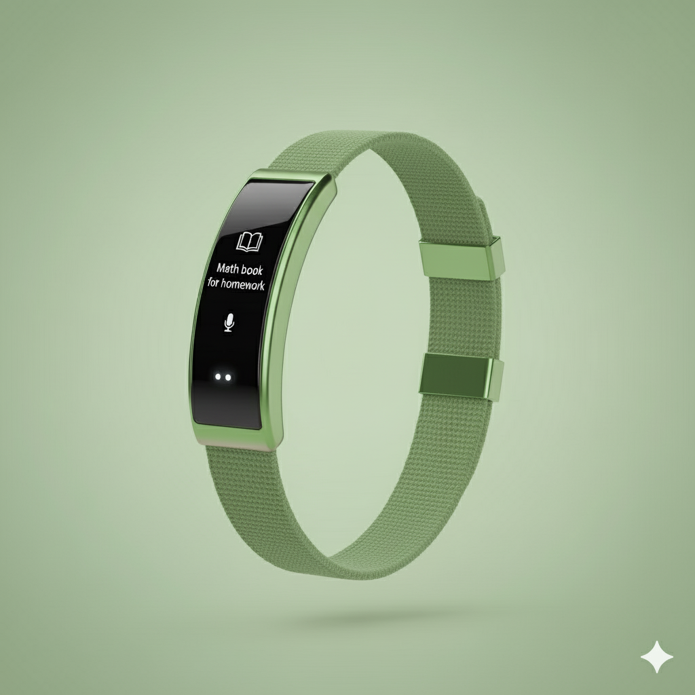
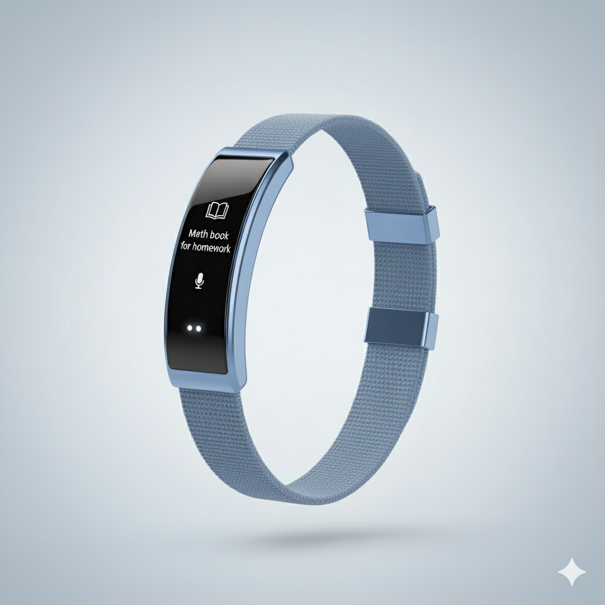
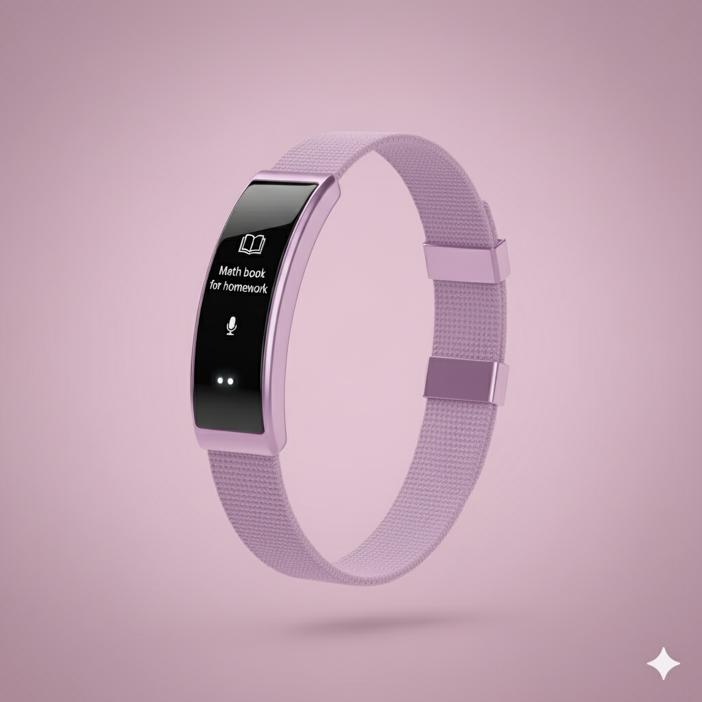
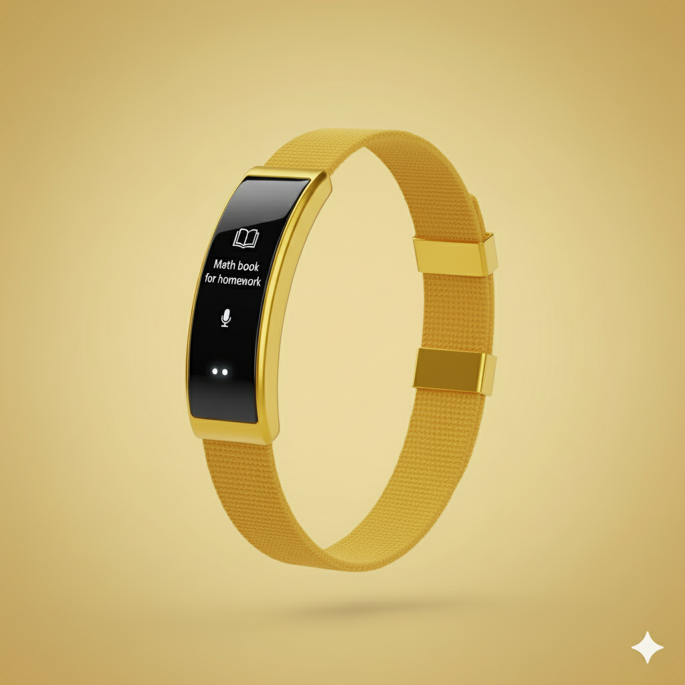
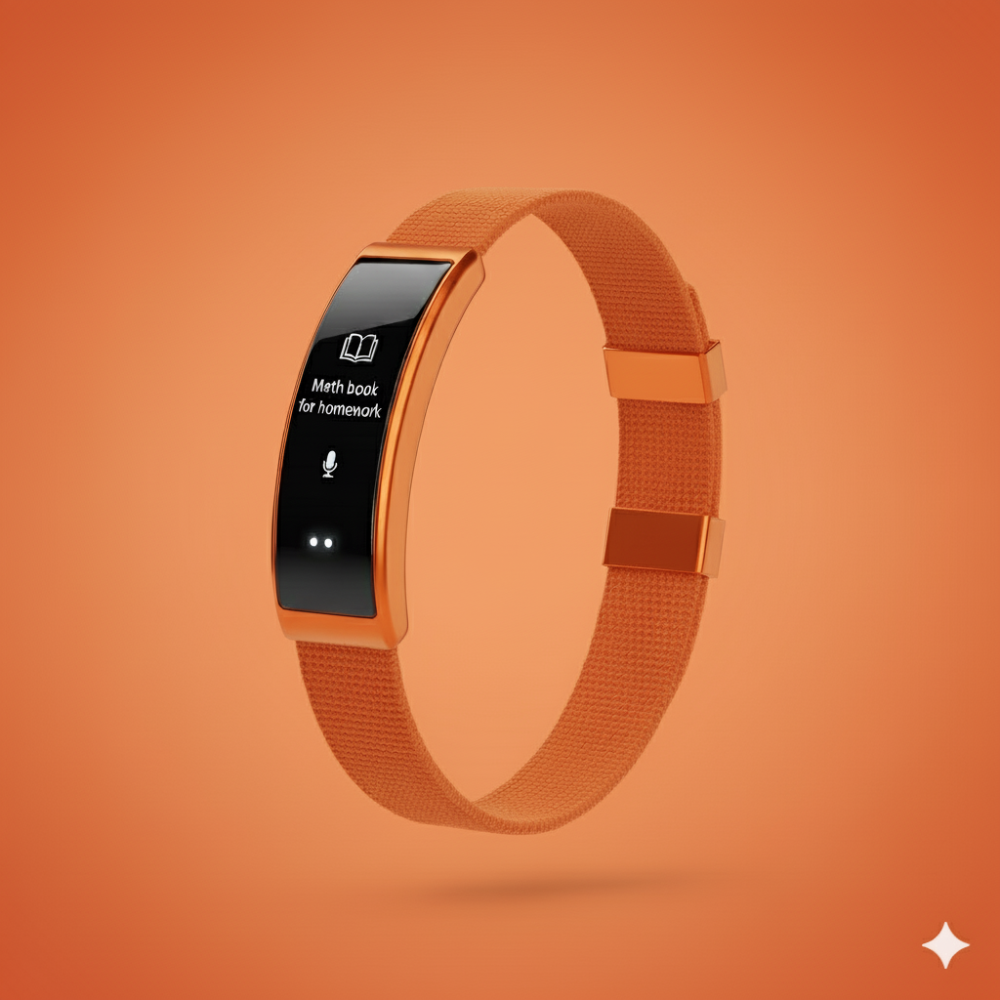
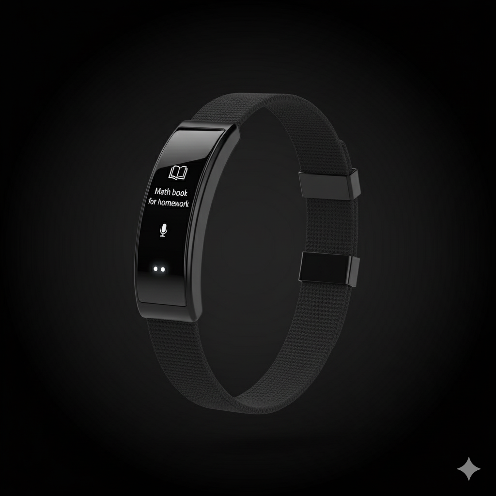
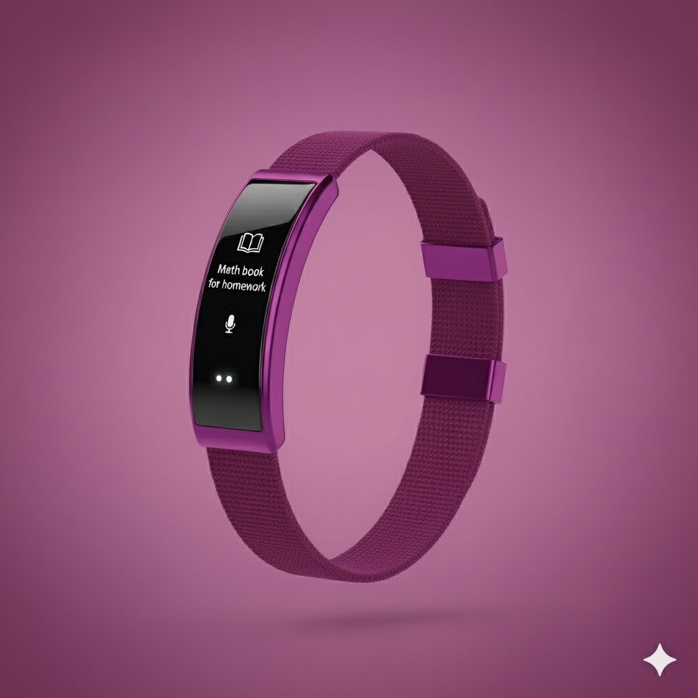
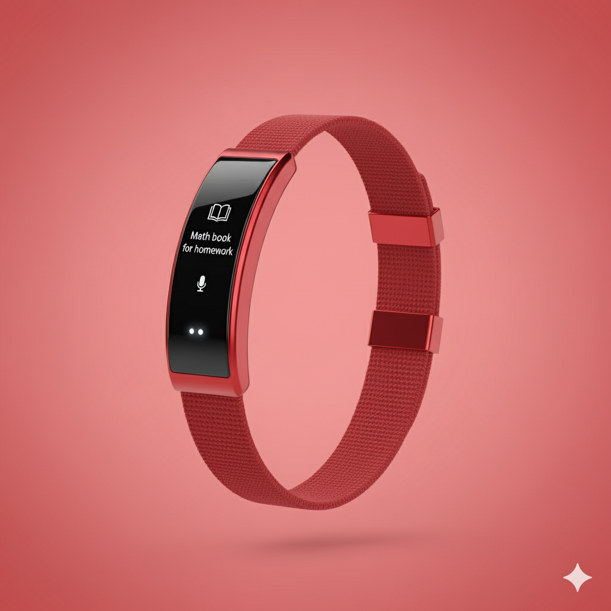
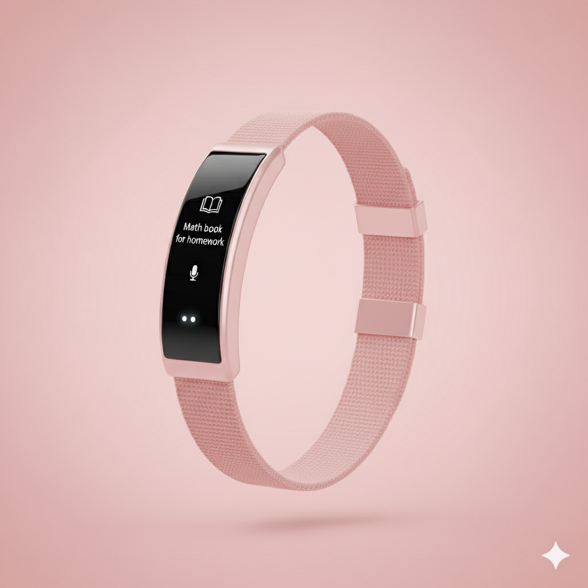

# EduBand – A Smart School Band

**EduBand is a wearable band for students. It helps with:**
- Homework and assignment reminders
- Showing the time
- Replacing school ID cards
- Tracking entry/exit from school
- Water/alarm reminders
- Syncing with school timetable and website
- Lots of fun colors!
## EduBand Design Images

## Why EduBand?
Students often forget their ID cards or homework. EduBand is easy to wear, stylish, and solves these problems!

## Features
- Homework reminders
- Student attendance tracking
- Water drinking reminders
- Timetable sync
- School website updates

## How it Works
The EduBand will connect with a mobile app using Bluetooth.

The band has a built-in display to show reminders sent from the app or school website.
Students will scan their EduBand when entering or leaving school using an RFID scanner at the gate.
The app will sync with the school timetable and send reminders.
The band will vibrate for water/alarm reminders.

## Project Team
Just me

## Want to help?
Suggest ideas, fix typos, or share your own experiences!
